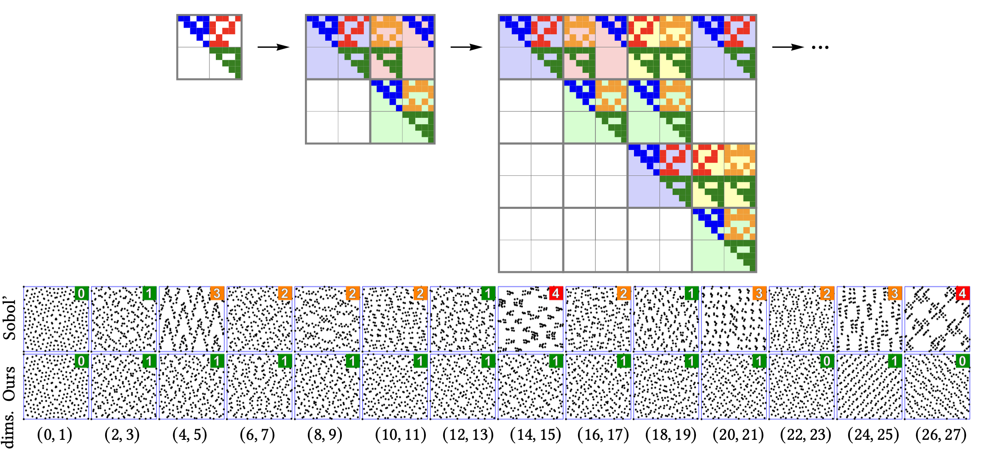

# Sobol’ Sequences with Guaranteed-Quality 2D Projections

This repository contains the supplementary material of the paper *Sobol’ Sequences with Guaranteed-Quality 2D Projections*, SIGGRAPH 2025.

## New Sobol' initialization matrices

Following Joe and Kuo format, we provide, in the `OneTwoSeq_data` folder, the list of polynomials and initialization matrices to generate low discrepancy sequences with (1,2)-sequence properties for consecutive projections, and optimized discrepancies for consecutive quadruples of dimensions.

## Stand-alone sampler and PBRT plugin

In the [sampler](sampler) folder, we provide the source code of a stand-alone sampler to generate samples using the new Sobol' matrices.

We also provide a [PBRT-v4](https://github.com/mmp/pbrt-v4) plugging allowing to reproduce the rendering results given in the main article.

